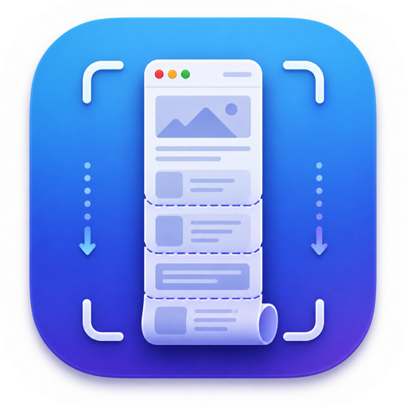
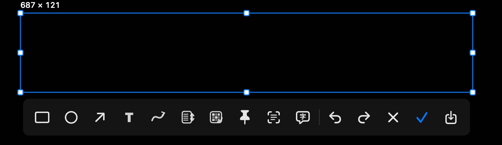
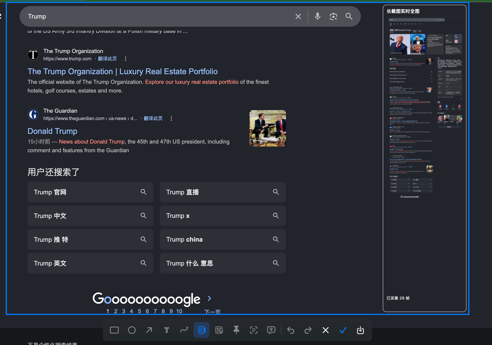

# LongScreenShot

<p align="center">
  
</p>

<p align="center">
  <strong>原生 macOS 菜单栏截图工具，支持截图、标注、OCR、图钉与长截图。</strong>
</p>

<p align="center">
  <a href="./README.md">简体中文</a> ·
  <a href="./README.en.md">English</a>
</p>

<p align="center">
  
  
  
  
</p>

---

## 介绍

**LongScreenShot** 是一款为 macOS 打造的原生菜单栏截图工具，基于 **Swift、AppKit、Vision、ScreenCaptureKit** 以及系统原生框架实现。

它希望把日常截图流程做得更轻、更顺手：从菜单栏快速启动，完成普通截图、窗口识别、自由框选、标注、马赛克、OCR、悬浮图钉和长截图等操作。

LongScreenShot 的重点不是堆功能，而是提供一个尽可能贴近 macOS 使用习惯的截图体验：轻量、直接、本地优先，并尽量减少不必要的权限请求。

> 当前支持 **macOS 14.0 及以上版本**。

---

## 预览

<p align="center">
  
</p>

<p align="center">
  
</p>

---

## 核心特性

### 截图与选区

- 菜单栏常驻入口，随时快速启动
- 支持录制全局快捷键，默认快捷键为 `⌘⇧2`
- 鼠标悬停时自动识别应用窗口
- 支持单击选择窗口，也支持拖拽自由框选
- 支持多显示器，按鼠标所在屏幕独立截图
- 截图过程中可随时按 `Esc` 全局退出
- 选区创建后可继续移动位置
- 支持通过四边与四角手柄精细调整选区大小
- 工具栏会根据选区位置自动调整显示位置

### 标注工具

- 矩形、圆形、箭头、文字
- 自由画笔
- 马赛克、高斯模糊、像素化
- 撤销 / 重做
- 支持 `⌘Z` 与 `⌘⇧Z`
- 支持实时调整文字字号、线条粗细与画笔颜色
- 工具栏图标带悬停说明，降低学习成本

### OCR、翻译与图钉

- 使用 Apple Vision 进行本地 OCR 识别
- OCR 结果可在 App 内展示
- 支持选择百度或谷歌作为翻译引擎
- 翻译结果优先在 App 内以原文 / 译文双栏形式展示
- 当网页接口不可用时，可自动打开对应翻译网页
- 截图可作为悬浮图钉固定在屏幕上
- OCR 识别结果可作为附着子窗显示在图钉右侧
- 图钉与 OCR 内容窗支持跨显示器拖动
- 图钉与 OCR 内容窗支持缩放
- 支持一键关闭全部图钉

### 长截图

LongScreenShot 的长截图不是简单拼接几张静态图片，而是基于连续帧流和位移匹配实现。

- 基于 ScreenCaptureKit 获取连续画面帧
- 用户手动滚动，不模拟鼠标滚轮
- 不需要“辅助功能 / 控制电脑”权限
- 使用 NCC 进行相邻帧重叠匹配
- 跟踪相邻原始帧之间的位移
- 提供实时 minimap 预览，方便观察当前拼接进度
- 使用有界顺序队列保留快速滚动中的中间帧
- 当匹配失效后，可从下一帧重新建立锚点
- 接缝会尽量避开文字行，优先选择低纹理空白区域
- 点击完成后会先排空待处理帧，尽量减少尾部内容丢失

### 设置

- 支持跟随系统语言
- 支持手动选择常用语言
- 支持配置开机启动
- 支持选择翻译引擎
- 内置关于信息

---

## 隐私与权限

LongScreenShot 尽量使用 macOS 系统原生能力，并优先在本机完成处理。

- OCR 使用 Apple Vision 在本地识别
- 截图、标注、图钉和长截图处理均在本机完成
- 长截图由用户手动滚动
- 不模拟鼠标或滚轮操作
- 不申请“辅助功能 / 控制电脑”权限

首次使用截图能力时，macOS 会要求授予以下权限：

```text
系统设置 → 隐私与安全性 → 屏幕与系统音频录制
```

这是 macOS 对截图、录屏和 ScreenCaptureKit 的系统级权限要求。

---

## 从源码运行

1. 克隆仓库：

```bash
git clone https://github.com/MustangYM/LongScreenShot.git
cd LongScreenShot
```

2. 使用 Xcode 打开项目中的 `.xcodeproj` 或 `.xcworkspace` 文件。
3. 选择 LongScreenShot 对应的 macOS App Target。
4. 点击 Run 运行。
5. 首次截图时，根据系统提示授予“屏幕与系统音频录制”权限。

如果授权后仍无法截图，可以尝试完全退出 App 后重新启动。

---

## 使用说明

启动 App 后，LongScreenShot 会常驻在 macOS 菜单栏中。

你可以通过菜单栏图标进入截图、长截图、设置、关闭图钉等功能，也可以使用已录制的全局快捷键快速启动截图。

默认快捷键：

```text
⌘⇧2
```

如果该快捷键与其他 App 冲突，可以在设置中重新录制。

---

## 适用场景

- 日常截图与快速标注
- 截取网页、文档、聊天记录中的长内容
- 临时固定图片、文字、验证码或参考资料
- 本地 OCR 识别截图中的文字
- 对截图文字进行快速翻译
- 在多显示器环境下进行截图与图钉整理

---

## 说明

LongScreenShot 仍在持续完善中。长截图效果会受到页面内容、滚动速度、动画、透明层、视频区域以及重复纹理等因素影响。

如果遇到拼接不准确的情况，可以尝试降低滚动速度，或避开包含大量动态内容的区域。
